Openshift Deployment 121
=======================

<TODO: add intro for public>

`oc` client can help a lot, but it still does not give information about all relationships. Honestly, there are very few good documents explaining full scope. And most of them expect you to know the basics. We will try to cover some of the basics here.

If you type ‘oc types’ in the CLI you will get an explanation of most of the component. Let's try cover how they can be used together with each other.

`[root@redhat /]# oc types` 
Together with `oc explain <object> ` this can give you documentation “on the fly”

```
* Image:
    A layered Linux filesystem that contains application code, dependencies,
    and any supporting operating system libraries. An image is identified by
    a name that can be local to the current cluster or point to a remote Docker
    registry (a storage server for images).
```

You can think about images as “just another packaging format”. Previously you were packaging your application in jars, wars, tars - now you do this in the images. The main difference is that images contain everything (except sensitive data) needed to run application code. So if you need  tomcat7 to run your application - you will package it together with your application code. Running image is called container.
  
```
* Containers:
    A definition of how to run one or more processes inside of a portable Linux
    environment. Containers are started from an Image and are usually isolated
    from other containers on the same machine.
```

Containers will be one of the main building blocks for your applications. But in Openshift environment they don't go alone. Container, built using good practices, requires few external inputs, so it is hard or sometimes even impossible to run it as a single container or your development laptop. You still need some layer of orchestration to do this. [Minishift](https://github.com/minishift/minishift) is local development environments to help with this. 

```
* Pods [pod]:
    A set of one or more containers that are deployed onto a Node together and
    share a unique IP and Volumes (persistent storage). Pods also define the
    security and runtime policy for each container.
```

As described Pod is a set of containers running on one node. Just to reiterate - pod is unsplittable. This means they are scheduled as one unit. 


```    
* Nodes [node]:
    Machines set up in the cluster to run containers. Usually managed
    by administrators and not by end users.
```

Node is a physical/virtual server, which runs the pods. Servers will run some additional processes too, but we will cover those later. Openshift is a multi-tenant environment. Meaning that your servers become commodity hardware and in the best case scenario you should not care where your application is running, or who is running together on the same node.  


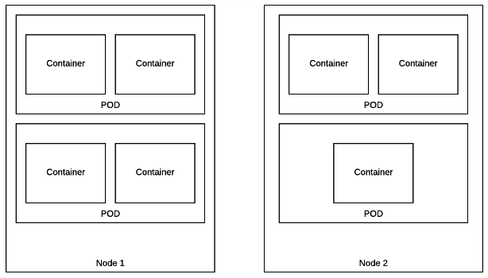

```
* Services [svc]:
    A name representing a set of pods (or external servers) that are
    accessed by other pods. The service gets an IP and a DNS name, and can be
    exposed externally to the cluster via a port or a Route. It's also easy
    to consume services from pods because an environment variable with the
    name <SERVICE>_HOST is automatically injected into other pods.
```

Service’s IP’s should not change during cluster lifecycle. Once you create service object it gets assigned IP and it should stay the same. Usage of IP’s should be avoided and Service Discovery used instead. Services are objects, that enable pods to communicate to each other and external world. 


Additionally, services can have different types.
Those can be found by executing:
```
oc explain svc.spec.type
FIELD: type <string>

DESCRIPTION:
     type determines how the Service is exposed. Defaults to ClusterIP. Valid
     options are ExternalName, ClusterIP, NodePort, and LoadBalancer.
     "ExternalName" maps to the specified externalName. "ClusterIP" allocates a
     cluster-internal IP address for load-balancing to endpoints. Endpoints are
     determined by the selector or if that is not specified, by manual
     construction of an Endpoints object. If clusterIP is "None", no virtual IP
     is allocated and the endpoints are published as a set of endpoints rather
     than a stable IP. "NodePort" builds on ClusterIP and allocates a port on
     every node which routes to the clusterIP. "LoadBalancer" builds on NodePort
     and creates an external load-balancer (if supported in the current cloud)
     which routes to the clusterIP. More info:
     http://kubernetes.io/docs/user-guide/services#overview

```

**So to sum-up:**
**ClusterIP** - service will get ClusterIP address and work as an internal loadbalancer for your pods. By default ClusterIP is NOT accessible from outside the cluster.  (1st picture)
**Headless Service** - Our Service will work as RoundRobbin DNS and when called will return poll members of underlying resources.  (2nd picture)
**LoadBalancer** - Works as Loadbalancer and exposes pods to outside world. (3rd picture, right top part) 
**NodePort** - Maps to particular PORT on each node. And if traffic reaches ANY cluster nodeIP and particular port - traffic will reach destination pod (3rd picture lower part)
**ExternalName** - allows you to abstract external resources (like dabatase) and show them as objects in Openshift. (2.1 picture)

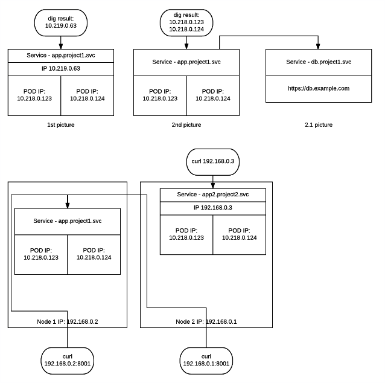

```
* Routes [route]:
    A route is an external DNS entry (either a top level domain or a
    dynamically allocated name) that is created to point to a service so that
    it can be accessed outside the cluster. The administrator may configure
    one or more Routers to handle those routes, typically through an Apache
    or HAProxy load balancer / proxy.
```
        
Routes will enable HTTP/HTTPS traffic to reach your pods from outside the cluster. Its simple Loadbalancer, which serves traffic to Services (Based on SNI)


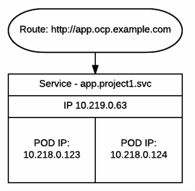


```
* Replication Controllers [rc]:
    A replication controller maintains a specific number of pods based on a
    template that match a set of labels. If pods are deleted (because the
    node they run on is taken out of service) the controller creates a new
    copy of that pod. A replication controller is most commonly used to
    represent a single deployment of part of an application based on a
    built image.
```

New name - ReplicaSet. It can be seen as a “watcher”. Each time you deploy a pod we describe a state ( in example3 replicas). Each time state is not as expected replication controller will try to fix it. 


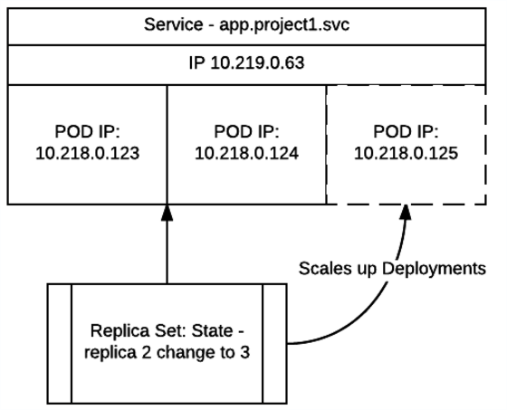

**Now we know basics, let’s look into how to build your applications and relationships there. **

```
* Image Streams and Image Stream Tags [is,istag]:
    An image stream groups sets of related images under tags - analogous to a
    branch in a source code repository. Each image stream may have one or
    more tags (the default tag is called "latest") and those tags may point
    at external Docker registries, at other tags in the same stream, or be
    controlled to directly point at known images. In addition, images can be
    pushed to an image stream tag directly via the integrated Docker
    Registry.
```

Image stream is one of the objects you might find difficult to understand if you are coming from Kubernetes’ world. It’s an abstraction for plain images. It allows more flexible image management in the platform. Best analogy would be soft links for binaries in linux. You can have your main image name, which will never change, and you just change pointer images.


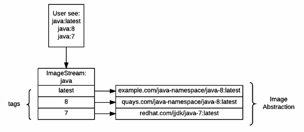

```
* Build Configuration [bc]:
    Contains a description of how to build source code and a base image into a
    new image - the primary method for delivering changes to your application.
    Builds can be source based and use builder images for common languages like
    Java, PHP, Ruby, or Python, or be Docker based and create builds from a
    Dockerfile. Each build configuration has web-hooks and can be triggered
    automatically by changes to their base images.
    
* Builds [build]:
    Builds create a new image from source code, other images, Dockerfiles, or
    binary input. A build is run inside of a container and has the same
    restrictions normal pods have. A build usually results in an image pushed
    to a Docker registry, but you can also choose to run a post-build test that
    does not push an image.
```

BuildConfiguration will be your main tool if you want to build your application code. Build is an object, spun from the BuildConfiguration itself. Implementation as you may call it. It takes Base Image abstracted with ImageStream, Code from Version control and produces output image.


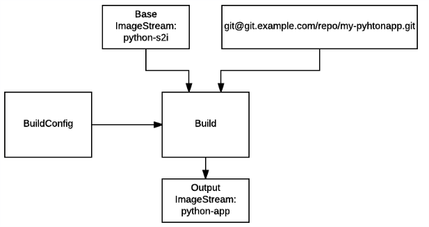

```
* Deployment Configuration [dc]:
    Defines the template for a pod and manages deploying new images or
    configuration changes whenever those change. A single deployment
    configuration is usually analogous to a single micro-service. Can support
    many different deployment patterns, including full restart, customizable
    rolling updates, and fully custom behaviors, as well as pre- and post-
    hooks. Each deployment is represented as a replication controller.
```

DeploymentConfig is an object which will spin your application pods. It contains full description how to run your application and how it should be mapped with other objects to create full application stack 


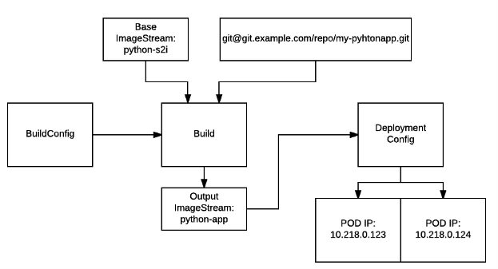

Now let's look into storage, persistence and configuration. Each application will require some configuration, persistence, storage. Or all of those.
 
``` 
* Volumes:
    Containers are not persistent by default - on restart their contents are
    cleared. Volumes are mounted filesystems available to Pods and their
    containers which may be backed by a number of host-local or network
    attached storage endpoints. The simplest volume type is EmptyDir, which
    is a temporary directory on a single machine. Administrators may also
    allow you to request a Persistent Volume that is automatically attached
    to your pods.
```

Secrets, Configs, Storage Volumes are just different types of volumes. Let’s see how they can be used. Simple storage is abstracted using PersistentVolume (PV) and PersistentVolumeClaims (PVC). Administrators usually maintain pool of PV’s and you need to submit a claim to get one. As long as claim exist, nobody else can use the same storage. Where to mount which PV is defined in DC. 

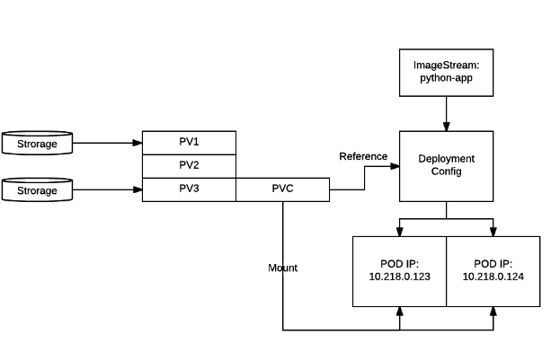


  ```
    * Secrets [secret]:
    The secret resource can hold text or binary secrets for delivery into
    your pods. By default, every container is given a single secret which
    contains a token for accessing the API (with limited privileges) at
    /var/run/secrets/kubernetes.io/serviceaccount. You can create new
    secrets and mount them in your own pods, as well as reference secrets
    from builds (for connecting to remote servers) or use them to import
    remote images into an image stream.
```


Secret is just another volume. But in this case it is not a plain readable text that resides in the key-value storage. Again, you just put sensitive data into it and mount it as a volume or expose it as environment variable. Secrets are mounted as tmpfs, so as soon as container/pod dies - secret is gone too.

   ConfigMap is very similar to Secrets and PV. It contains application configuration and is mounted as a volume. The difference between secret and ConfigMap is that ConfigMap is not encrypted. 


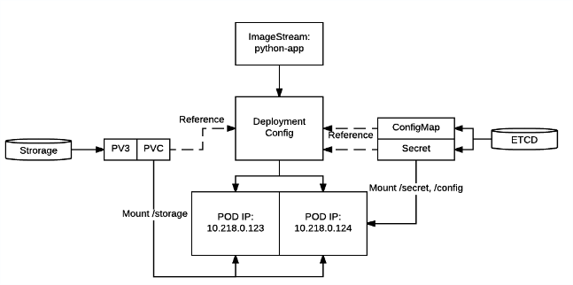


```
* Projects [project]:
    All of the above resources (except Nodes) exist inside of a project.
    Projects have a list of members and their roles, like viewer, editor,
    or admin, as well as a set of security controls on the running pods, and
    limits on how many resources the project can use. The names of each
    resource are unique within a project. Developers may request projects
    be created, but administrators control the resources allocated to
    Projects.
```

Self explanatory :) This is how multi-tenancy is implemented. 

```
* Labels:
    Labels are key value pairs that can be assigned to any resource in the
    system for grouping and selection. Many resources use labels to identify
    sets of other resources.
```

Labels are the things you will have to get used to. You will need to label everything, and most of the resources are bound to each other using labels and selectors. For example Services and PODs know which one is which based on labels. DeploymentConfigs knows on which servers/workers pods can be ran. 


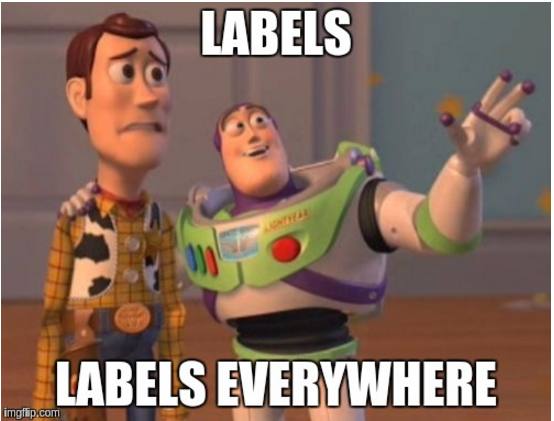

Now some of the other concepts you might find around the place:

**Triggers**:
Openshift contains multiple options for those. You can set BC to be executed when new image was published or new code pushed to Git. DeploymentConfig refreshed when Build Publishes new image or configuration changes (secret, configmap, replica count, etc). This makes your environment dynamic.
 
**DaemonSet**:
DaemonSet is very useful when you need to run containers on each node or set of nodes. It takes labels and makes sure container runs as per labels. It being used to run monitoring agents, log shipping, or any other utilities, which needs dynamic scalability based on resources. In example if you scale number of nodes DaemonSet will make sure new node has an instance of your container running.

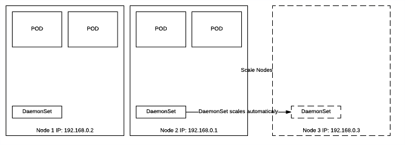

**StatfullSet**:
As per Kubernetes documentation: `Manage the deployment and scaling of a set of Pods, and provide guarantees about ordering. They do so by maintaining a unique, sticky identity for each of their Pods.`

For example if you spin standard pods you will get random names assigned to them :
```
my-app-4f45f
my-app-23fdf
```
This makes harder to orchestrate applications which require ordering or use clustering methods. StatufllSet makes sure scaling and naming is consistent. For example:
```
my-app-1
my-app-2
...
```
As soon as you scale my-app-3 will be created. If my-app-1 dies it will get recreated and only then scaling happens. Applications like ETCD, KAFKA, REDIS, ZOOKEEPER use this together with headless services to orchestrate Master elections and master-slave relationships.


**Templates**:
Templates is Openshift’s way to replicate same deployments over and over again. It just takes objects’ descriptions and replaces placeholders with parameters. It helps to have one file and replicate same deployments multiple times instead of rewriting files.

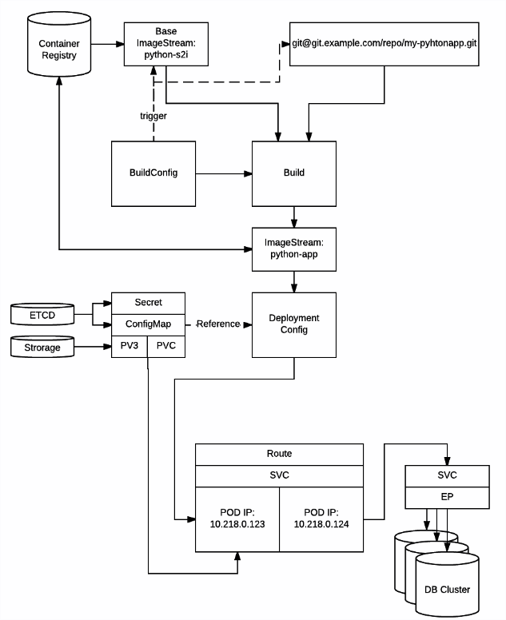

These are just small insights how the main components relate to each other. And small illustration how small stack of components could looks like (picture above). There are many more components involved and even more coming. But in the end you can imagine all these building blocks as a big LEGO game. You take a bunch of them and build something. 


